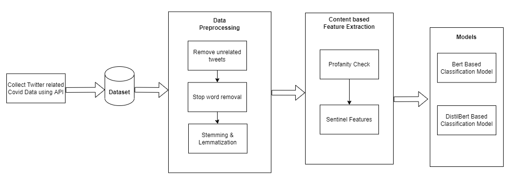

# Covid19 Misinformation Detection in Social Media

Fake news is a type of propaganda where misinformation is intentionally spread through news outlets and/or social media outlets. The gradual spread of fake news and misleading information during hard times can have dire consequences, causing widespread panic and exacerbating the apparent threat of a pandemic that we cannot ignore.

To deal with these challenges, this project proposes a robust approach to classify misinformation about Covid-19 using social media data.

## Methodology

The proposed method incorporates BERT based text embeddings along with additional features obtained from the Feature Extraction module. This will enable us to identify and extract linguistic features like abusive language and sentinel features, from a given unstructured raw tweet. 

The hypothesis is that giving the extracted supplementary features to the classification model will boost the accuracy of detecting the fake information.

### Feature Engineering

The following features were used for classification
- BERT based Text Embedding
- Profanity Scores
- Sentinel Features
  - Length
  - Number of Uppercase letters
  - Number of Question marks
  - Number of Esclamation marks

## Block Diagram

## Dataset

[Constraint.AI-2021](https://constraint-shared-task-2021.github.io/) is a shared task on hostile post detection which contains data collected from sources including various social-media platforms such as Twitter, Facebook, Instagram. Each record comprises a tweet related to Covid-19 and a label to denote its credibility. There are around 6000 records for training, 2000 for validation and 2000 for testing.

## Results

| S.No | Model | Accuracy %
:-------------------------:|:-------------------------:|:-------------------------:|
1|Bert|84.11
2|Bert with Text Features|86.54
3|DistilBert|92.75
4|DistilBert with Text Features|94.03
